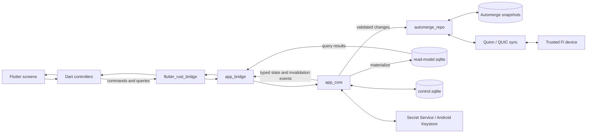

# Fi

Fi is a local-first personal finance application for Linux Wayland desktops and
Android phones. Flutter provides the interface, while Rust owns finance rules,
durable state, device identity, pairing, and peer-to-peer synchronization.
There is no application server: paired devices replicate directly over the
local network and keep working offline.

> **Alpha:** breaking changes and data-format changes are still possible. The
> supported application targets are Linux on Wayland and Android only.

## Screenshots

Screenshots are still to be added. Suggested captures for a future
`docs/screenshots/` directory are:

| Transactions | Categories | Device pairing |
| --- | --- | --- |
| _Screenshot placeholder_ | _Screenshot placeholder_ | _Screenshot placeholder_ |

## Software stack

| Layer | Technology | Responsibility |
| --- | --- | --- |
| User interface | Flutter, Dart, Material 3 | Responsive Linux and Android presentation |
| Native boundary | `flutter_rust_bridge` | Typed commands, queries, DTOs, and event streams |
| Application core | Rust, Tokio | Finance rules, lifecycle, pairing, routing, and sync policy |
| Local-first data | Automerge | Authoritative conflict-free finance documents |
| Query model | SQLite through `rusqlite` | Rebuildable categories, transactions, and aggregates |
| Peer transport | Quinn, QUIC, Rustls | Authenticated and pinned device sessions |
| Discovery | private DNS-SD through `mdns-sd` | LAN discovery without exposing a stable public group name |
| Device security | Ed25519, HKDF/HMAC/SHA-2, Linux Secret Service, Android Keystore | Identity, trust, pairing, and protected secrets |
| Toolchain | Nix flakes, Rust 1.90+, Flutter, Android SDK/NDK, JDK 17, CMake/Ninja | Reproducible development and builds |

The Nix development shell in [`flake.nix`](flake.nix) provides the supported
Rust, Flutter, Android, Linux, Wayland smoke-test, and bridge-generation tools.

## Architecture and data flow

The compile-time dependency direction is deliberately one way:

```text
Flutter -> app_bridge -> app_core -> automerge_repo -> automerge
```

At runtime, commands travel down to the authoritative Automerge document.
Changes update a disposable SQLite projection and return to Flutter as typed
events and refreshed queries. Trusted peers exchange Automerge sync frames over
authenticated QUIC sessions.



Automerge snapshots are the source of truth. `read-model.sqlite` can be deleted
and rebuilt. `control.sqlite` stores non-secret bootstrap, trust, connection,
pairing, and discovery metadata; private key and discovery-secret bytes stay in
the platform secure store. See [`docs/operations.md`](docs/operations.md) for
the complete storage and recovery contract.

## Repository structure

```text
fi/
├── Cargo.toml                    Rust workspace and shared dependency pins
├── flake.nix                     Nix development toolchain
├── crates/
│   ├── automerge_repo/           Generic actor-owned document repository
│   │   ├── src/                  Bootstrap, storage, sync, and transport ports
│   │   └── tests/                Repository acceptance and lifecycle tests
│   ├── app_core/                 Finance domain and application infrastructure
│   │   ├── src/                  Domain, projection, identity, pairing, and QUIC
│   │   ├── fixtures/             Stable protocol fixtures
│   │   └── tests/                Finance, pairing, transport, and secrecy tests
│   └── app_bridge/               Narrow Flutter-facing Rust adapter
│       └── src/api/              Commands, queries, lifecycle, and DTO mapping
├── flutter_app/
│   ├── lib/                      Flutter UI, controllers, and generated Dart API
│   ├── android/                  Android runner, Keystore, and multicast adapter
│   ├── linux/                    GTK Linux runner
│   ├── rust_builder/             Cargokit glue that embeds app_bridge
│   ├── test/                     Dart unit and widget tests
│   └── integration_test/         Connected Android lifecycle smoke test
├── docs/                         Operations and discovery notes
├── openspec/specs/               Behavioral specifications
└── scripts/                      Quality, codegen, and Wayland smoke checks
```

## Prerequisites

- Nix with flakes enabled.
- A Linux Wayland session for the desktop application.
- For Android: a USB-connected or network-connected Android device with USB
  debugging enabled. The flake intentionally does not install an emulator or
  system image.
- Both devices must be on a LAN that permits multicast DNS and direct peer
  traffic for discovery and synchronization.

Enter the development environment from the repository root:

```sh
nix develop
```

All remaining commands in this README assume that shell is active.

## Development builds

### Rust workspace

```sh
cargo build --workspace
cargo test --workspace
```

### Linux Wayland

```sh
cd flutter_app
flutter pub get
GDK_BACKEND=wayland flutter run -d linux
```

Flutter hot reload is available in this mode. To verify that the debug bundle
starts without an X11 fallback, build it and run the headless Weston smoke test:

```sh
cd flutter_app
flutter build linux --debug
cd ..
scripts/smoke-linux-wayland.sh
```

### Android

Connect a device, accept its debugging prompt, then select the identifier shown
by Flutter:

```sh
cd flutter_app
flutter devices
flutter run -d <device-id>
```

Android networking is foreground-only. Discovery and sync start on resume and
stop when the application is backgrounded; there is no WorkManager job,
foreground service, or persistent daemon.

## Production-mode builds

Build optimized Rust libraries independently with:

```sh
cargo build --workspace --release
```

Normal Flutter builds invoke Cargo through `flutter_app/rust_builder`, so a
separate Rust build is not required when producing the applications.

### Linux release bundle

```sh
cd flutter_app
flutter build linux --release
./build/linux/x64/release/bundle/fi
```

The complete relocatable bundle is
`flutter_app/build/linux/x64/release/bundle/`. Keep its `fi`, `lib/`, and `data/`
contents together.

### Android release artifacts

```sh
cd flutter_app
flutter build apk --release
flutter build appbundle --release
```

The APK is written to
`flutter_app/build/app/outputs/flutter-apk/app-release.apk`; the Play-style
bundle is written to
`flutter_app/build/app/outputs/bundle/release/app-release.aab`.

The current Gradle configuration signs release artifacts with the debug key so
that alpha builds can be installed locally. Before publishing, create and
protect a release keystore, configure a release signing profile in
`flutter_app/android/app/build.gradle.kts`, and rebuild the AAB. Never publish
or distribute the current debug-signed artifact as a production release.

## Packaging and local installation

### Linux

Create an archive without separating the executable from its libraries:

```sh
cd flutter_app
flutter build linux --release
tar -C build/linux/x64/release -czf fi-linux-x64.tar.gz bundle
```

For a per-user installation on the machine that built it:

```sh
install -d "$HOME/.local/opt/fi" "$HOME/.local/bin"
cp -a build/linux/x64/release/bundle/. "$HOME/.local/opt/fi/"
ln -sfn "$HOME/.local/opt/fi/fi" "$HOME/.local/bin/fi"
fi
```

Ensure `$HOME/.local/bin` is on `PATH`. The bundle still relies on compatible
host GTK, Wayland, and Secret Service libraries. A Nix-built bundle is not a
distro-neutral package; use it on the same compatible NixOS system or run it
from `nix develop`. The repository does not yet ship a flake package, AppImage,
Flatpak, or distribution package.

### Android

Install the locally built APK on a connected device with:

```sh
cd flutter_app
adb install -r build/app/outputs/flutter-apk/app-release.apk
```

An AAB cannot be installed directly; it must be signed and delivered by a store
or converted into device-specific APKs with an Android bundle tool.

## Generated bridge code

Rust and Dart bindings are committed. Verify that they reproduce cleanly from
the repository root:

```sh
scripts/check-frb-generated.sh
```

Run this after changing any public function or DTO below
`crates/app_bridge/src/api/`.

## Quality checks

```sh
cargo fmt --all --check
cargo test --workspace
cargo clippy --workspace --all-targets --all-features -- -D warnings
cargo deny check licenses
cargo audit
scripts/check-frb-generated.sh
scripts/check-flutter.sh
```

The connected Android instrumentation steps and operational security notes are
documented in [`docs/operations.md`](docs/operations.md). DNS-SD compatibility
details are in [`docs/mdns-compatibility.md`](docs/mdns-compatibility.md).
