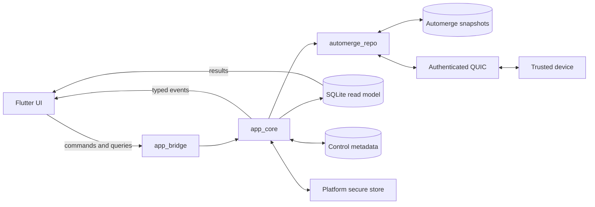

# Fi

Fi is a local-first personal finance app for Linux Wayland and Android. Flutter
provides the UI; Rust owns finance rules, storage, pairing, and peer-to-peer
synchronization. There is no application server.

> **Alpha:** breaking and data-format changes are expected. Other platforms are
> not supported.

## Screenshots

| Transactions | Categories | Device pairing |
| --- | --- | --- |
| _Screenshot pending_ | _Screenshot pending_ | _Screenshot pending_ |

Future captures should live in `docs/screenshots/`.

## Software stack

| Layer | Technology |
| --- | --- |
| UI | Flutter, Dart, Material 3 |
| Native bridge | `flutter_rust_bridge` |
| Application | Rust, Tokio |
| Source of truth | Automerge |
| Query model | SQLite |
| Peer networking | private DNS-SD, Quinn/QUIC, Rustls |
| Secrets | Linux Secret Service, Android Keystore |
| Toolchain | Nix, Rust 1.90+, Flutter, Android SDK/NDK, JDK 17 |

## Architecture

Dependencies flow in one direction:

```text
Flutter -> app_bridge -> app_core -> automerge_repo -> automerge
```



Automerge snapshots are authoritative; the SQLite read model is disposable and
rebuildable. See [operations](docs/operations.md) for storage and recovery.

## Repository structure

```text
fi/
├── crates/
│   ├── automerge_repo/   Generic Automerge actors, persistence, and sync
│   ├── app_core/         Finance domain, projection, identity, and networking
│   └── app_bridge/       Flutter-facing Rust API
├── flutter_app/          Linux Wayland and Android application
├── docs/                 Operations and compatibility notes
├── openspec/specs/       Behavioral specifications
├── scripts/              Checks, code generation, and Wayland smoke test
├── Cargo.toml            Rust workspace
└── flake.nix             Development toolchain
```

Crate-specific details are in the READMEs for
[`automerge-repo`](crates/automerge_repo/README.md),
[`app-core`](crates/app_core/README.md), and
[`app-bridge`](crates/app_bridge/README.md).

## Development

Enter the toolchain and test the Rust workspace:

```sh
nix develop
cargo build --workspace
cargo test --workspace
```

For Linux Wayland and Android development, release builds, artifact locations,
signing, and local installation, follow the
[Flutter application guide](flutter_app/README.md).

## Checks

```sh
cargo fmt --all --check
cargo test --workspace
cargo clippy --workspace --all-targets --all-features -- -D warnings
cargo deny check licenses
cargo audit
scripts/check-frb-generated.sh
scripts/check-flutter.sh
```

Android instrumentation and the headless Wayland smoke test are documented in
the [Flutter guide](flutter_app/README.md#tests-and-generated-code).
