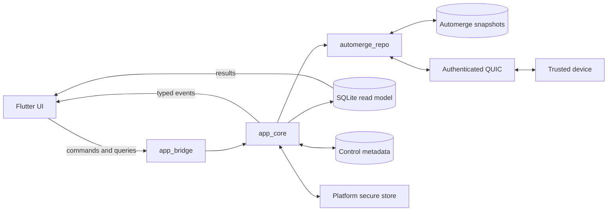

# Fi

Fi is a local-first schema-driven collections app for Linux Wayland and Android.
Flutter provides the UI; Rust owns schemas, typed records, storage, pairing, and
peer-to-peer synchronization. There is no application server.

> **Alpha:** breaking and data-format changes are expected. Other platforms are
> not supported.

## Screenshots

| Collections | Schema editor | Device pairing |
| --- | --- | --- |
| _Screenshot pending_ | _Screenshot pending_ | _Screenshot pending_ |

Future captures should live in `docs/screenshots/`.

## Software stack

| Layer | Technology |
| --- | --- |
| UI | Flutter, Dart, Material 3 |
| Native bridge | `flutter_rust_bridge` |
| Application | Rust, Tokio |
| Source of truth | Automerge |
| Query model | SQLite |
| Peer networking | private DNS-SD, Quinn/QUIC, Rustls |
| Secrets | Linux Secret Service, Android Keystore |
| Toolchain | Nix, Rust 1.90+, Flutter, Android SDK/NDK, JDK 17 |

## Architecture

Dependencies flow in one direction:

```text
Flutter -> app_bridge -> app_core -> automerge_repo -> automerge
```


```mermaid
flowchart LR
    UI[Flutter UI] -->|commands and queries| BRIDGE[app_bridge]
    BRIDGE --> CORE[app_core]
    CORE --> REPO[automerge_repo]
    REPO <--> DATA[(Automerge snapshots)]
    CORE --> VIEW[(SQLite read model)]
    CORE <--> CONTROL[(Control metadata)]
    CORE <--> SECRETS[Platform secure store]
    REPO <--> QUIC[Authenticated QUIC]
    QUIC <--> PEER[Trusted device]
    VIEW -->|results| UI
    CORE -->|typed events| UI
```

Automerge snapshots are authoritative; the SQLite read model is disposable and
rebuildable. See [operations](docs/operations.md) for storage and recovery.

## Repository structure

```text
fi/
├── crates/
│   ├── automerge_repo/   Generic Automerge actors, persistence, and sync
│   ├── app_core/         Collection domain, projection, identity, and networking
│   └── app_bridge/       Flutter-facing Rust API
├── flutter_app/          Linux Wayland and Android application
├── docs/                 Operations and compatibility notes
├── openspec/specs/       Behavioral specifications
├── scripts/              Checks, code generation, and Wayland smoke test
├── Cargo.toml            Rust workspace
└── flake.nix             Development toolchain
```

Crate-specific details are in the READMEs for
[`automerge-repo`](crates/automerge_repo/README.md),
[`app-core`](crates/app_core/README.md), and
[`app-bridge`](crates/app_bridge/README.md).

## Development

Enter the toolchain and test the Rust workspace:

```sh
nix develop
cargo build --workspace
cargo test --workspace
```

For Linux Wayland and Android development, release builds, artifact locations,
signing, and local installation, follow the
[Flutter application guide](flutter_app/README.md).

## Linux firewall and OpenSnitch

fi uses two kinds of UDP traffic on the LAN:

- **UDP `47380-47389`** for QUIC sync and pairing. Each running instance binds
  two ports from this range, lowest free first: the sync endpoint, then the
  pairing endpoint above it. One instance normally holds `47380` and `47381`; a
  second instance on the same host takes `47382` and `47383`. If every port in
  the range is busy, fi opens with device networking off and shows a banner with
  a retry; it never falls back to a random port. See
  [Network ports](docs/operations.md#network-ports).
- **UDP `5353`** multicast (`224.0.0.251` / `ff02::fb`) for mDNS discovery.

Android needs no rule. Two things on a Linux desktop block this traffic, and
both were measured, not guessed.

**1. Inbound QUIC is dropped by the host firewall.** The NixOS firewall accepts
mDNS (avahi adds UDP 5353) and replies to dials this host starts, but drops a
dial *from* another device unless the range is open. Allow it from your LAN
subnet (adjust `192.168.0.0/24`).

NixOS, in `configuration.nix`:

```nix
networking.firewall.allowedUDPPortRanges = [{ from = 47380; to = 47389; }];
```

ufw:

```sh
sudo ufw allow from 192.168.0.0/24 to any port 47380:47389 proto udp
```

iptables (lost on reboot; on NixOS insert into `nixos-fw`):

```sh
sudo iptables -I nixos-fw 1 -s 192.168.0.0/24 -p udp --dport 47380:47389 -j nixos-fw-accept
```

**2. OpenSnitch holds the first QUIC packet.** The app's first packet to a new
peer — its reply to an inbound dial included — is a new outbound flow. OpenSnitch
queues it for a prompt and, unanswered, denies after 30 s, which is exactly the
pairing timeout. Add a permanent rule instead: allow process `fi`, protocol
`udp`, destination port matching the regex `^4738[0-9]$`. Also allow UDP port
`5353` for `fi` if mDNS is not already permitted.

Check both from another LAN host: `ping` in both directions must succeed, and on
Android the phone's default route must be Wi-Fi (`adb shell ip route get <desktop-ip>`
must name `wlan0`); if it names a cellular interface, turn mobile data off.

## Checks

```sh
cargo fmt --all --check
cargo test --workspace
cargo clippy --workspace --all-targets --all-features -- -D warnings
cargo deny check licenses
cargo audit
scripts/check-frb-generated.sh
scripts/check-flutter.sh
```

Android instrumentation and the headless Wayland smoke test are documented in
the [Flutter guide](flutter_app/README.md#tests-and-generated-code).
